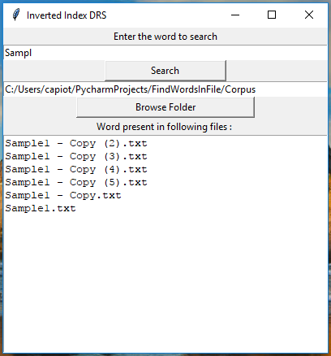

# Inverted-Index-based-Retrieval-System
This is a document retrieval system. For a given word which is searched, it finds all the files within a folder which contains that particular word. It does so by means of inverted index structure. Before creating the inverted index, Text processing is done on the text within the files. 

## Getting Started
* run User Interface.py

### Prerequisites
* Download and install Python(v>3).

